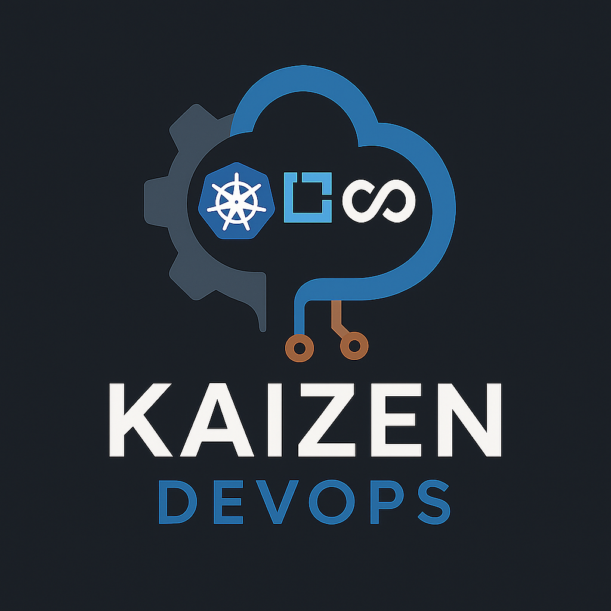

# kaizendevops 
Website for the business kaizendevops

## Colors used for this website and logo

| Purpose / Element           | Hex Code  | RGB               | Notes                                |
| --------------------------- | --------- | ----------------- | ------------------------------------ |
| Cloud outline (top right)   | `#1D74B7` | rgb(29, 116, 183) | Dominant outer cloud blue            |
| Kubernetes logo background  | `#326CE5` | rgb(50, 108, 229) | Blue hexagon behind K8s ship wheel   |
| Middle square (DevOps logo) | `#4CB2E2` | rgb(76, 178, 226) | Light cyan-blue square outline       |
| "DEVOPS" text               | `#3B7ABD` | rgb(59, 122, 189) | Slightly muted blue used in the text |
