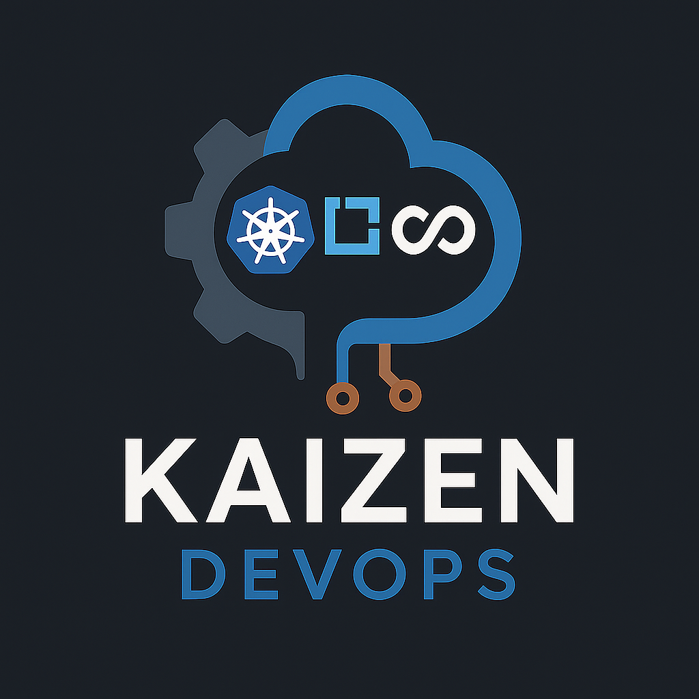

# Welcome to Kaizen DevOps

## Why Kaizen?

**Kaizen** means “continuous improvement.” It’s more than a method — it’s a mindset. I believe small, consistent improvements lead to lasting impact. No big-bang overhauls — just focused, steady progress. That’s the essence of Kaizen.

## Why DevOps?

**DevOps** is the link between development and operations. It’s about faster delivery, reliable systems, and smarter automation. It’s not just tools — it’s a culture. I help teams build that culture.

## My Philosophy

Simple. Efficient. Transparent.

Whether I’m automating infrastructure, building CI/CD pipelines, or guiding teams through agile and DevOps practices, I focus on clarity and long-term value. Less noise, more results.

---

## What I Do

=== "Automate"
- Infrastructure as Code (IaC)
- CI/CD pipelines
- Container platforms

=== "Accelerate"
- Streamlined deployments
- Shorter feedback loops
- Less manual toil

=== "Improve"
- Resilient systems
- Kaizen-driven delivery
- Continuous feedback

---

## Services

- 🚀 **Infrastructure as Code** — Terraform, Ansible, GitOps
- 📦 **Containers & Platforms** — Kubernetes, OpenShift, Podman
- 🔁 **CI/CD Automation** — GitHub Actions, GitLab CI, ArgoCD
- 📊 **Monitoring & Observability** — Prometheus, Grafana, Zabbix
- 🔐 **Security & Compliance** — DevSecOps integration
- 👥 **Coaching & Mentoring** — DevOps culture, Agile coaching

---

## My Approach

**Start small. Scale smart.**

Every engagement starts with listening — understanding what really matters. Then we build practical, scalable solutions together. No lock-in, no over-engineering. Just clean, reliable infrastructure that works.

---

## Ready to Build?

Let’s bring continuous improvement to your team, platform, or process.  
📩 [kaizendevops@pm.me](mailto:kaizendevops@pm.me)

